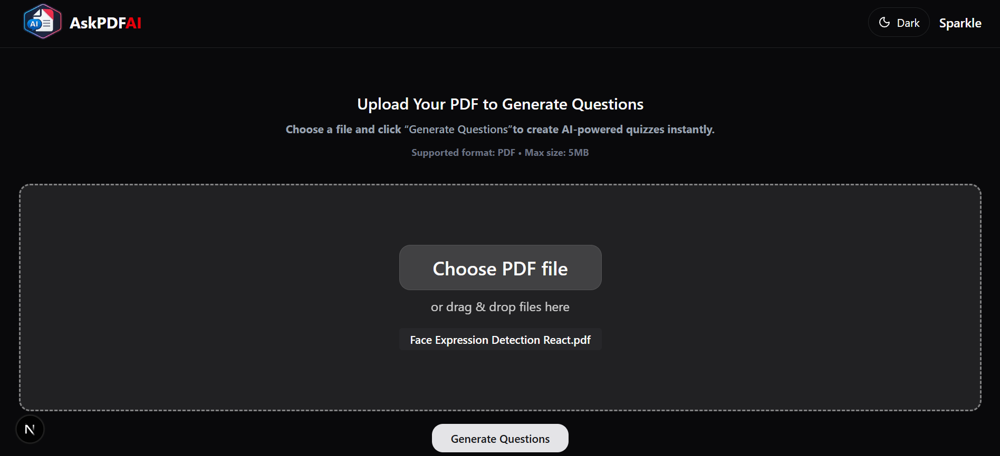
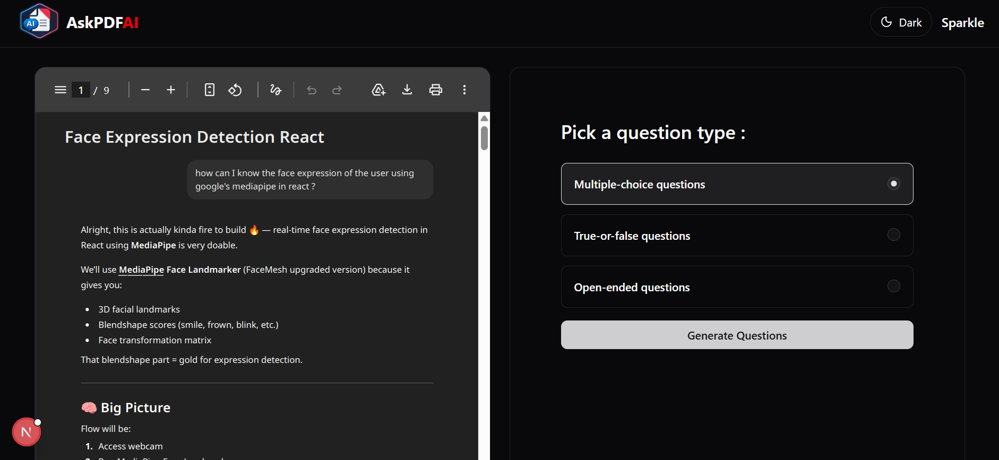
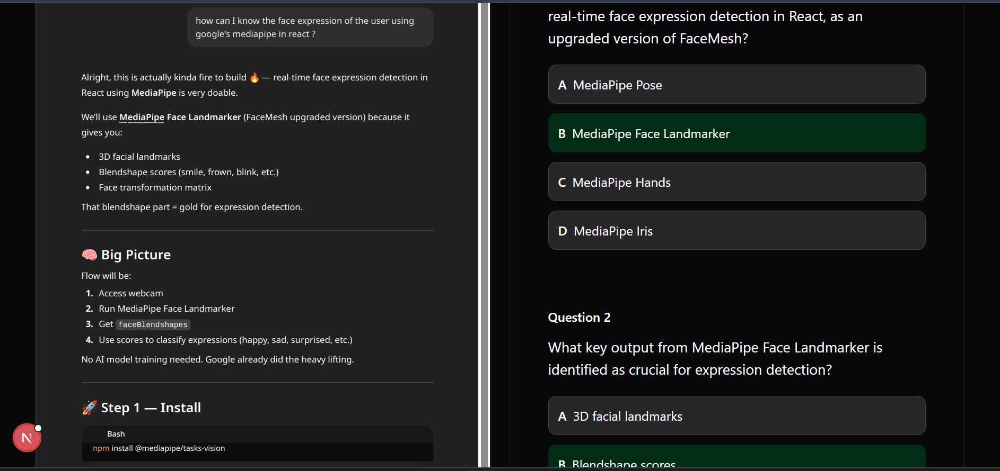
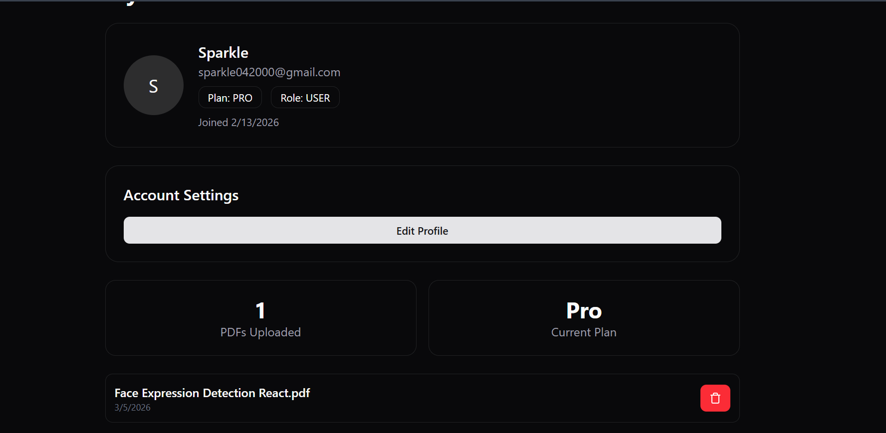

# 🖥️ AI Question Generator Client (AskPDFAI)

A modern frontend application built with **Next.js** that allows users to upload PDFs and generate **MCQs** and **Q&A pairs** using AI.

This client communicates with the backend API to provide a smooth and interactive user experience.

---

## 🚀 Features

- 📄 Upload PDF files (drag & drop support)
- 🧠 Generate:
  - MCQs (Multiple Choice Questions)
  - Q&A (Question & Answer pairs)
- 📊 View generated questions
- 🔐 Authentication (Login / Google OAuth)
- 🌙 Dark mode support
- ⚡ Fast UI with React Query
- 🔔 Toast notifications

---

## 🛠️ Tech Stack

- **Framework:** Next.js 16
- **Language:** TypeScript
- **UI:** Tailwind CSS + ShadCN UI
- **State Management:** React Query
- **Forms:** React Hook Form + Zod
- **File Upload:** React Dropzone
- **PDF Viewer:** React PDF
- **API Client:** Axios
- **Notifications:** React Toastify

---






## 📂 Project Structure

```src/
│
├── app/ # App router pages
├── components/ # Reusable UI components
├── lib/ # API calls, utilities
├── hooks/ # Custom hooks
```

---

## ⚙️ Installation & Setup

### 1️⃣ Clone Repository

````bash
git clone https://github.com/RanjanaRK/ai-question-generator-client.git
cd ai-question-generator-client

2️⃣ Install Dependencies
npm install

3️⃣ Setup Environment Variables

Create a .env.local file:

NEXT_PUBLIC_API_URL=http://localhost:8000
4️⃣ Run Development Server
npm run dev

App will run on:

http://localhost:3000
``` bash
````

---

## 🔗 API Integration

This frontend connects to the backend:

👉 http://localhost:8000

Example Endpoints Used:

- POST /api/upload
- POST /api/generate/mcq
- POST /api/generate/qa
- GET /api/mcq/:pdfId
- GET /api/qa/:pdfId

## 📄 Main Features Flow

### 📤 Upload PDF

- Drag & drop or select file
- Sent to backend using FormData
- Receives pdfId

### 🧠 Generate AI Content

Send pdfId to:

- /generate/mcq
- /generate/qa
- Display results in UI

### 📊 View Results

- MCQs displayed with options
- Q&A displayed in readable format

### 🎨 UI Features

- Dark / Light mode (next-themes)
- Clean UI using Tailwind + ShadCN
- Fast loading with React Query caching
- Toast notifications for actions

### 🔒 Authentication

- Login using email/password
- Google OAuth support
- Session-based authentication

---

### 🌟 Future Improvements

- 📊 Dashboard for analytics
- 📥 Export MCQs as PDF
- 🎯 Difficulty selection
- 🧠 AI explanation for answers

---

## 🌐 Backend Repository

https://github.com/RanjanaRK/ai-question-generator-server

---

## ⭐ Support

If you like this project, give it a ⭐ on GitHub!

## 👨‍💻 Author

**Ranjana Kumari**  
Full-Stack Developer (Next.js · Node.js · MongoDB · Express)

🔗 LinkedIn: https://www.linkedin.com/in/ranjanark/

🐙 GitHub: https://github.com/RanjanaRK

## 📄 License

This project is licensed under the **MIT License**.
